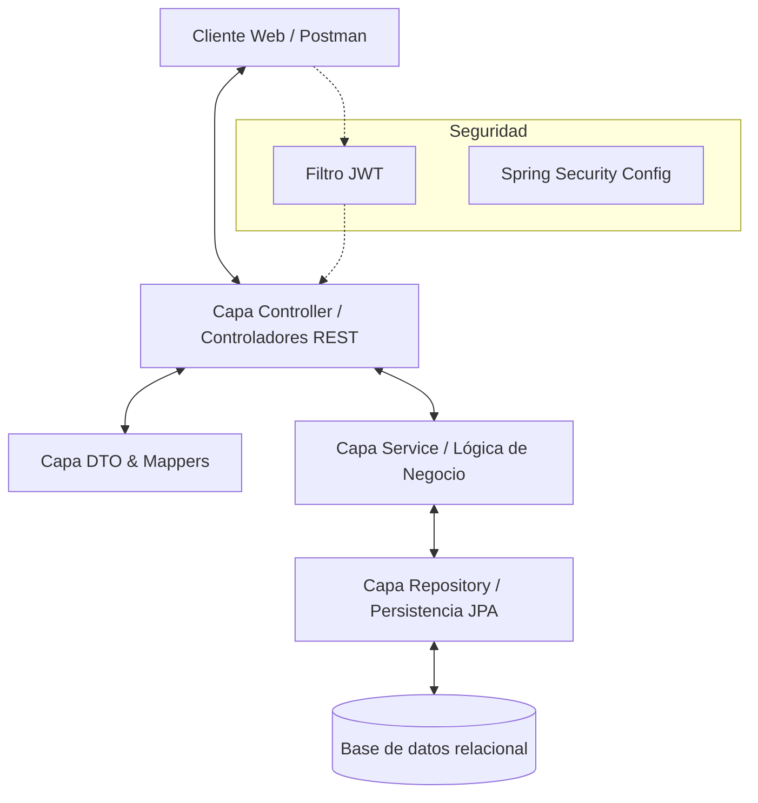
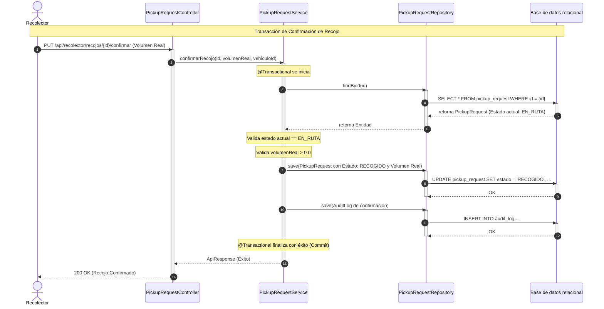
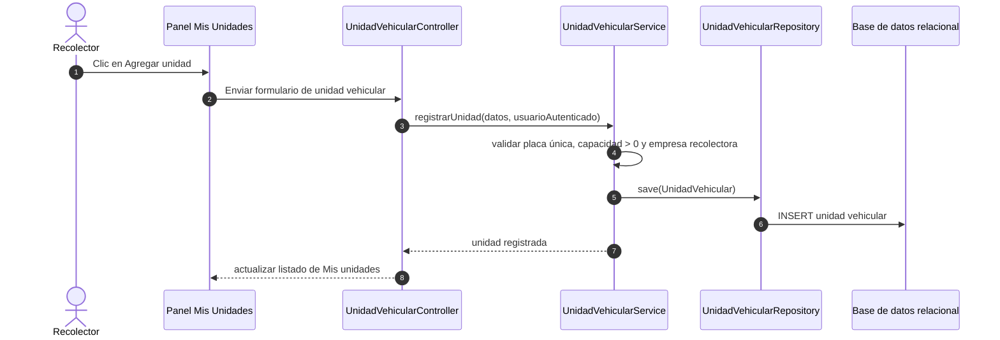

# Diseño de Arquitectura Técnica (architecture.md)

**Proyecto**: ECO_TACNA - Gestión de Recojo de Aceite Usado
**Versión**: 1.1.0-MVP
**Patrón Arquitectónico**: MVC (Model-View-Controller) / Capas Clásicas de Spring Boot

---

## 1. Patrón Arquitectónico y Capas

El backend de **ECO_TACNA** se estructura de manera rigurosa siguiendo el patrón de **Arquitectura en Capas (MVC)** aplicado a servicios backend REST. Este diseño promueve un desacoplamiento eficiente de responsabilidades, facilitando la mantenibilidad, escalabilidad y la ejecución de pruebas unitarias y de integración autónomas.

### 1.1. Capa de Presentación / Controladores (Controller)
* **Ubicación**: `com.proyecto.controller`
* **Responsabilidades**:
  * Recibir y mapear las solicitudes HTTP a través de anotaciones Spring Web (`@RestController`, `@RequestMapping`, `@PostMapping`, `@GetMapping`, etc.).
  * Validar sintácticamente la información entrante mediante anotaciones de validación estándar (`@Valid`, `@NotNull`, `@Min`, `@Size`).
  * Estructurar y enviar las respuestas del API REST a través de la envoltura unificada `ApiResponse<T>` y clases de respuesta estándar de Spring Web (`ResponseEntity`).
  * Delegar las operaciones críticas directamente a la capa de Servicios.

### 1.2. Capa de Negocio / Servicios (Service)
* **Ubicación**: `com.proyecto.service`
* **Responsabilidades**:
  * Implementar las reglas de negocio del MVP (ej. verificar la validez de la suscripción del generador antes de permitir una solicitud de recojo).
  * Manejar el control transaccional mediante la anotación `@Transactional` de Spring, asegurando que las operaciones concurrentes se ejecuten bajo límites de aislamiento seguros.
  * Orquestar la comunicación entre múltiples repositorios para persistir los cambios relacionales y generar de forma paralela los registros inmutables en la tabla de auditoría básica.

### 1.3. Capa de Persistencia / Repositorios (Repository)
* **Ubicación**: `com.proyecto.repository`
* **Responsabilidades**:
  * Definir interfaces que extienden de `JpaRepository` (Spring Data JPA) para interactuar con la base de datos relacional.
  * Proveer métodos de consulta abstractos y consultas personalizadas mediante `@Query` para gestionar búsquedas complejas e históricos de recojo.

### 1.4. Capa de Dominio / Modelos (Model)
* **Ubicación**: `com.proyecto.model`
* **Responsabilidades**:
  * Definir las entidades relacionales anotadas con `@Entity` y mapear sus atributos y tipos.
  * Establecer la consistencia relacional y mapeo de llaves foráneas (`@ManyToOne`, `@OneToMany`, `@JoinColumn`) utilizando estrategias de carga perezosa (`FetchType.LAZY`) para optimizar el rendimiento y evitar problemas de N+1 consultas.
  * Definir enums del dominio operativo (`CompanyType`, estados de recojo, estados de unidad vehicular y estados de suscripción).

### 1.5. Capa de DTOs y Mapeadores (DTO & Mapper)
* **Ubicación**: `com.proyecto.dto` y `com.proyecto.mapper`
* **Responsabilidades**:
  * **DTOs**: Estructurar los payloads de entrada y salida, aislando el modelo interno de la base de datos de las respuestas expuestas al cliente para evitar fugas de información sensible.
  * **Mapeadores**: Abstraer la conversión de tipos modelo-entidad a DTOs y viceversa, manteniendo la legibilidad del código.

### 1.6. Capa de Seguridad (Security)
* **Ubicación**: `com.proyecto.security`
* **Responsabilidades**:
  * Configurar las políticas globales de seguridad de Spring Security y declarar rutas públicas frente a privadas.
  * Validar firmas de tokens JWT transmitidos en las cabeceras HTTP de autorización en cada petición entrante.
  * Cargar los roles (`ROLE_ADMIN`, `ROLE_GENERADOR`, `ROLE_RECOLECTOR`) al contexto de seguridad de la aplicación para el control de accesos.

---

## 2. Flujo Transaccional Principal del MVP

El control operativo del sistema está protegido transaccionalmente por Spring AOP mediante la gestión del ciclo de vida de transacciones. Esto garantiza la consistencia física de la base de datos durante las transiciones de estado lógico.

### 2.1. Flujo técnico de solicitud de recojo
Cuando una empresa de tipo `GENERADORA` crea una solicitud de recojo, el flujo técnico opera del siguiente modo:
1. El controlador recibe la petición, valida los campos mínimos (volumen aproximado $> 0.0$, fecha sugerida y dirección no vacías) y la envía al servicio.
2. El servicio abre una transacción (`@Transactional`), valida que la empresa generadora autenticada tenga su estado de suscripción como `ACTIVA`.
3. Si la validación es exitosa, se crea el registro de `PickupRequest` con estado inicial `PENDIENTE`.
4. Paralelamente, se inserta una fila en `AuditLog` registrando la acción. El commit final persiste los datos de forma atómica.

### 2.2. Flujo técnico de atención del recojo
Cuando un recolector interactúa con una solicitud, la confirmación física se procesa bajo el siguiente flujo:

### 2.3. Control para evitar inconsistencias de estado
Para proteger el sistema de actualizaciones inválidas sobre solicitudes de recojo que ya han sido canceladas o ya están finalizadas, se implementa una lógica de **validación de precondiciones de estado**:
* Previo a cualquier transición de estado (ej. cambiar a `EN_RUTA` o `RECOGIDO`), el servicio de negocio recupera el registro vigente de la base de datos y compara el estado actual contra la transición permitida de acuerdo con las reglas operativas de `spec.md`.
* Si una solicitud no se encuentra en el estado inicial esperado, el servicio lanza inmediatamente una excepción de tipo `IllegalStateException` o una excepción personalizada de negocio.
* Esto detiene inmediatamente el procesamiento y activa el **Rollback transaccional** de Spring Data, previniendo actualizaciones incorrectas o estados corruptos en la base de datos.

---

## 3. Módulos del Sistema

El backend unifica la estructura modular bajo el principio de diseño MVC sin dependencias externas complejas.

### 3.1. Paquetes y responsabilidades
* **`controller`**: Recibe las llamadas del frontend y Postman, filtrando las entradas y devolviendo respuestas envueltas en la estructura uniforme `ApiResponse<T>`.
* **`service`**: Contiene los métodos del negocio, validaciones operativas e integraciones lógicas de la plataforma.
* **`repository`**: Interactúa de forma directa con la base de datos mediante interfaces limpias de JPA.
* **`model`**: Define entidades (como `User`, `Company`, `PickupRequest`, `TransportUnit`, `AuditLog`) y enums del negocio.
* **`dto`**: Define las clases de mensajería (Request y Response) y envolturas genéricas del API.
* **`security`**: Implementa filtros JWT (`JwtAuthenticationFilter`), configuraciones globales (`WebSecurityConfig`) y el mapeo de usuarios del sistema (`UserDetails`).

### 3.2. Gestión técnica de unidades vehiculares
El registro y mantenimiento de las unidades vehiculares se gestiona de forma autónoma desde el panel de la empresa recolectora:
* **Formulario de registro**: El sistema requerirá los siguientes campos: placa, modelo, capacidad en litros, tipo, estado y observación.
* **Validación de Datos del Dominio**: Se implementan validaciones de datos obligatorias a nivel de DTO y entidad JPA:
  * La placa es obligatoria, única a nivel global y se normaliza transformándola estrictamente a mayúsculas antes de persistir.
  * La capacidad en litros es obligatoria y debe ser estrictamente mayor a cero ($L > 0.0$).
  * Estado de la unidad asignado por defecto a `ACTIVO` o definido explícitamente según la operación de recojo.
* **Vinculación estricta**: La unidad queda vinculada a la empresa recolectora autenticada. El recolector no puede registrar, modificar ni visualizar unidades de transporte pertenecientes a otra empresa u organización.

A continuación, se detalla el flujo técnico de registro de una nueva unidad vehicular:

### 3.3. Modelo de suscripción mensual
El modelo de suscripción se modela lógicamente a nivel arquitectónico mediante un atributo de estado (`SubscriptionStatus`) contenido dentro de la entidad `Company`:
* **Estados**: `ACTIVA`, `PENDIENTE`, `VENCIDA`, `SUSPENDIDA`.
* **Intercepción a Nivel de Negocio**: Antes de procesar operaciones principales, como crear solicitudes de recojo, atender recojos, confirmar recojos o registrar unidades vehiculares, la capa de servicios verifica el estado de suscripción de la empresa. Si el estado es `VENCIDA`, `PENDIENTE` o `SUSPENDIDA`, la operación se aborta mediante una excepción controlada, devolviendo un error HTTP 403 Forbidden o 400 Bad Request.

### 3.4. Restricciones técnicas del entregable
* **Cero APIs Externas**: El MVP funciona sin llamados de red remotos. La validación de empresas se maneja de forma administrativa o interna, y la ubicación del recojo se registra mediante dirección textual o referencia, sin geolocalización externa.
* **Seguridad Basada en Tokens**: Todas las peticiones exceptuando el login y el registro requieren la presencia del token JWT firmado en las cabeceras. La expiración y validación se resuelven en memoria a nivel del backend.
