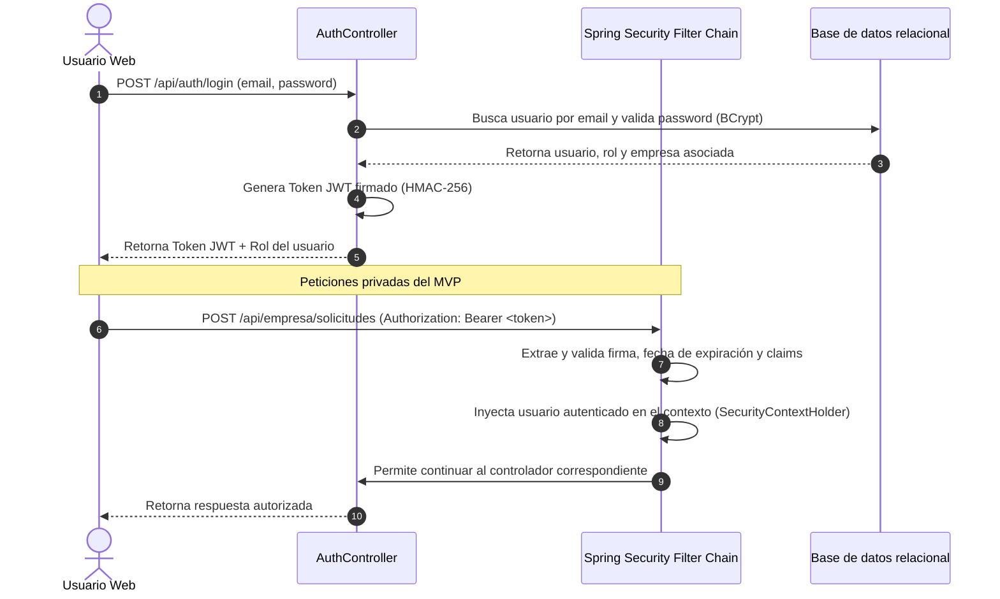

# Esquema de Seguridad y Autorización (security.md)
**Proyecto**: ECO_TACNA - Gestión de Recojo de Aceite Usado
**Versión**: 1.1.0-MVP
**Tecnología**: Spring Security + JWT (JSON Web Tokens)

---

## 1. Flujo de Autenticación y Ciclo del Token JWT

El sistema utiliza autenticación basada en tokens JWT sin estado (stateless). El flujo de autenticación entre el cliente web y el servidor se describe en el siguiente diagrama:



### Detalles del Token JWT:
* **Algoritmo de Firma**: HMAC-256 (`HS256`).
* **Secreto de Firma**: Definido de forma segura en `application.properties` (se requiere clave de 256 bits codificada en Base64).
* **Tiempo de Expiración**: 24 horas por defecto para operaciones de la plataforma.
* **Estructura del Payload (Claims)**:
  ```json
  {
    "sub": "contacto@cevicheria-el-puerto.com",
    "role": "ROLE_GENERADOR",
    "companyId": 12,
    "companyName": "Cevicheria El Puerto",
    "iat": 1716279150,
    "exp": 1716365550
  }
  ```

---

## 2. Encriptación de Contraseñas

* **Algoritmo**: **BCrypt** (`BCryptPasswordEncoder`).
* **Fuerza de Hash (Strength/Work Factor)**: `12` rondas (proporciona un excelente equilibrio entre seguridad criptográfica contra ataques de fuerza bruta y rendimiento de cómputo en servidores modernos).
* **Uso**: Las contraseñas en crudo ingresadas durante el registro son encriptadas inmediatamente antes de guardarse en la tabla `users`. El proceso de autenticación realiza la comparación segura mediante `passwordEncoder.matches(rawPassword, encodedPassword)`.

---

## 3. Matriz de Control de Acceso basado en Roles (RBAC)

El acceso a los endpoints REST se restringe explícitamente en la configuración de la cadena de filtros de Spring Security (`SecurityFilterChain`). La siguiente tabla muestra los roles requeridos para cada ruta del sistema orientada al seguimiento operativo de recojo:

| Método HTTP | Ruta Endpoint | Roles Autorizados | Acción |
| :---: | :--- | :---: | :--- |
| **GET** | `/api/health` | `permitAll` | Estado básico del sistema |
| **GET** | `/`, `/index.html`, `/dashboard.html`, `/css/**`, `/js/**` | `permitAll` | Recursos públicos del frontend |
| **POST** | `/api/auth/register` | `permitAll` | Registro de usuario o empresa |
| **POST** | `/api/auth/login` | `permitAll` | Inicio de sesión y obtención del token JWT |
| **GET/POST** | `/api/empresa/solicitudes/**` | `ROLE_GENERADOR` | Crear y consultar solicitudes propias |
| **PUT** | `/api/empresa/solicitudes/*/cancelar` | `ROLE_GENERADOR` | Cancelar solicitud propia cuando corresponda |
| **GET** | `/api/empresa/solicitudes/*/historial` | `ROLE_GENERADOR` | Consultar historial de estados de una solicitud propia |
| **GET** | `/api/recolector/recojos/**` | `ROLE_RECOLECTOR` | Consultar recojos asignados o disponibles |
| **PUT** | `/api/recolector/recojos/*/en-ruta` | `ROLE_RECOLECTOR` | Marcar recojo como en ruta |
| **PUT** | `/api/recolector/recojos/*/confirmar` | `ROLE_RECOLECTOR` | Confirmar recojo y registrar volumen real |
| **GET** | `/api/recolector/unidades/**` | `ROLE_RECOLECTOR` | Consultar unidades vehiculares propias |
| **POST** | `/api/recolector/unidades` | `ROLE_RECOLECTOR` | Registrar nueva unidad vehicular propia |
| **PUT** | `/api/recolector/unidades/*` | `ROLE_RECOLECTOR` | Actualizar unidad vehicular propia |
| **GET/POST/PUT** | `/api/admin/**` | `ROLE_ADMIN` | Panel administrativo, aprobación de empresas, auditoría y reportes |
| **GET** | `/api/admin/unidades/**` | `ROLE_ADMIN` | Visualizar unidades vehiculares registradas por recolectores |
| **GET** | `/api/admin/solicitudes/**` | `ROLE_ADMIN` | Consultar solicitudes y seguimiento operativo general |
| **GET/PUT** | `/api/admin/suscripciones/**` | `ROLE_ADMIN` | Consultar o actualizar estado de suscripción mensual |

### Seguridad en unidades vehiculares

- Solo `ROLE_RECOLECTOR` puede registrar unidades vehiculares desde su panel.
- Cada unidad vehicular debe vincularse automáticamente a la empresa recolectora autenticada.
- El backend no debe confiar en un `empresaId` enviado por el cliente para crear unidades vehiculares.
- Si el formulario envía algún identificador de empresa, el servicio debe ignorarlo y usar la empresa obtenida desde el usuario autenticado.
- Un recolector solo puede consultar, actualizar o desactivar unidades de su propia empresa.
- `ROLE_ADMIN` puede visualizar las unidades vehiculares registradas por todas las empresas recolectoras.
- `ROLE_GENERADOR` no debe tener acceso al módulo de unidades vehiculares.

### Seguridad en suscripción mensual

- El sistema maneja suscripción mensual para empresas generadoras y recolectoras.
- Los estados contemplados son `ACTIVA`, `PENDIENTE`, `VENCIDA` y `SUSPENDIDA`.
- No se integrará pasarela de pago externa en este MVP.
- El estado de suscripción se gestionará internamente.
- Si el sistema restringe operaciones por suscripción, la validación debe realizarse en backend, no solo en frontend.
- Solo `ROLE_ADMIN` debe poder actualizar estados de suscripción, salvo que más adelante se implemente un flujo automatizado.

---

## 4. Políticas de Seguridad Adicionales

1. **Deshabilitación de CSRF**: Dado que la API es sin estado (stateless) y utiliza autenticación basada en tokens JWT transmitidos en la cabecera `Authorization` (y no en cookies de sesión automáticas del navegador), la protección contra falsificación de solicitudes entre sitios (CSRF) se deshabilita para simplificar la interoperabilidad de clientes REST.
2. **CORS (Cross-Origin Resource Sharing)**: Se configurará una política CORS estricta permitiendo únicamente solicitudes provenientes del dominio/puerto del cliente web autorizado o la URL en producción de la plataforma, rechazando orígenes desconocidos.
3. **Usuario ADMIN inicial**: `AdminBootstrapConfig` crea automáticamente el usuario `admin@ecotacna.com` al arrancar el backend si no existe en base de datos (configurable a nivel de `application.properties`), para evitar que el sistema quede sin administración inicial.
4. **Validación de Identidad en Controladores**: Además de la validación de roles de Spring Security a nivel de ruta HTTP, la capa de servicios validará que los IDs enviados por el cliente para modificar registros (por ejemplo, agregar unidades vehiculares) correspondan exactamente a la identidad extraída del Token JWT, impidiendo el secuestro o modificación de registros de terceros.
5. **Manejo de Excepciones de Seguridad**:
   - `400 Bad Request`: datos inválidos de entrada.
   - `401 Unauthorized`: usuario no autenticado o token inválido.
   - `403 Forbidden`: usuario autenticado sin permisos suficientes.
   - `404 Not Found`: recurso inexistente o no perteneciente al usuario autenticado.
   - `409 Conflict`: conflicto de integridad, por ejemplo placa vehicular duplicada.
