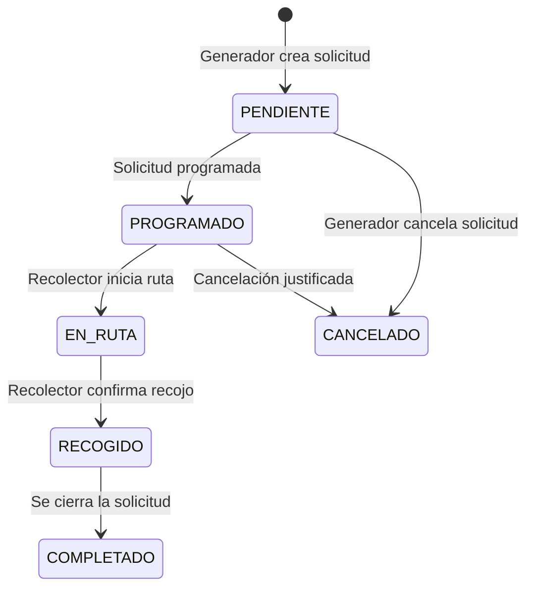

# Especificación de Requerimientos del Sistema (spec.md)
**Proyecto**: ECO_TACNA - Gestión de Recojo de Aceite Usado y Suscripción Mensual
**Versión**: 1.1.0-MVP
**Arquitectura**: MVC en Spring Boot

---

## 1. Introducción y Propósito

El sistema **ECO_TACNA** es una plataforma web transaccional diseñada para Tacna, Perú, orientada a la gestión y digitalización del proceso de recojo de aceite vegetal usado. El sistema permite:
* Registrar restaurantes o empresas generadoras de aceite usado.
* Registrar empresas recolectoras o recicladoras.
* Gestionar solicitudes de recojo de manera eficiente.
* Asignar o permitir la atención de solicitudes por parte de los recolectores.
* Registrar y gestionar unidades vehiculares de las empresas recolectoras.
* Controlar el estado actual del proceso de recojo.
* Consultar el historial operativo de las actividades realizadas.
* Gestionar un modelo de suscripción mensual para habilitar las operaciones de restaurantes y recolectores.

Para este entregable del MVP, el sistema se desarrollará utilizando el framework **Spring Boot** junto con **JPA/Hibernate** para la persistencia, operando de manera local y sin integración de APIs externas (como servicios de SUNAT reales, Google Maps o pasarelas de pago externas).

### Contexto de la Problemática
Actualmente, el proceso de recolección de aceite vegetal usado en la ciudad de Tacna suele manejarse de forma informal e ineficiente. Los restaurantes acumulan el aceite usado en sus establecimientos y coordinan su retiro con recolectores de manera informal a través de llamadas de voz, mensajes de WhatsApp o contacto presencial esporádico. Esto genera una falta de control centralizado sobre las solicitudes, inexistencia de un registro claro de las unidades vehiculares disponibles para la operación, y la ausencia de un flujo digital simple para coordinar, registrar estados y mantener un seguimiento operativo entre la empresa generadora y la empresa recolectora. Como datos pendientes para sustento académico de esta situación en la región, se deberán completar los siguientes aspectos:
* `[PENDIENTE: número de restaurantes evaluados]` restaurantes evaluados con problemas de almacenamiento.
* `[PENDIENTE: litros promedio de aceite usado]` litros promedio de aceite usado desechados mensualmente de forma inadecuada.
* `[PENDIENTE: recolectores identificados]` recolectores formales e informales identificados operando en la zona urbana de Tacna.

*(Nota de evolución futura: En fases posteriores, se podría contemplar una expansión hacia un modelo de comercio o marketplace B2B de lotes de aceite vegetal procesado, integraciones externas y pasarelas de pago, pero dicho alcance queda fuera de este MVP).*

---

## 2. Actores del Sistema

El sistema identifica los siguientes roles y actores con responsabilidades y permisos claramente definidos para la gestión de recojos:

### 2.1. Administrador del Sistema (`ROLE_ADMIN`)
* Encargado de la supervisión técnica y operativa de todo el ecosistema.
* **Acciones autorizadas**:
  * Validar y/o aprobar de forma manual o interna el registro de nuevas empresas.
  * Revisar el listado y detalle de las empresas generadoras.
  * Revisar el listado y detalle de las empresas recolectoras.
  * Consultar todas las solicitudes de recojo registradas en el sistema.
  * Consultar los estados actuales e históricos de los recojos.
  * Visualizar las unidades vehiculares registradas por cada una de las empresas recolectoras.
  * Gestionar y verificar el estado de las suscripciones mensuales de las empresas.
  * Consultar reportes operativos básicos del sistema.
  * Consultar la bitácora operativa básica del sistema.

### 2.2. Empresa Generadora (`ROLE_GENERADOR`)
* Representa a los restaurantes, pollerías, chifas, cevicherías u otros negocios formales generadores de aceite vegetal usado.
* **Acciones autorizadas**:
  * Registrarse e iniciar sesión en el sistema.
  * Crear solicitudes de recojo, ingresando volumen aproximado en litros, fecha sugerida/programada, dirección textual o referencia, y observaciones.
  * Consultar el listado de sus solicitudes de recojo enviadas.
  * Ver el estado actual de sus solicitudes.
  * Cancelar solicitudes de recojo cuando sea oportuno y corresponda.
  * Mantener su suscripción mensual activa para poder operar y realizar solicitudes en la plataforma.

### 2.3. Empresa Recolectora (`ROLE_RECOLECTOR`)
* Representa a las empresas recicladoras o recolectoras autorizadas para el transporte y acopio de aceite usado.
* **Acciones autorizadas**:
  * Registrarse e iniciar sesión en el sistema.
  * Consultar el listado de recojos asignados o disponibles para su atención.
  * Marcar una solicitud de recojo en estado "en ruta" (`EN_RUTA`).
  * Confirmar la ejecución del recojo y registrar obligatoriamente el volumen real recolectado en litros.
  * Consultar resúmenes operativos o documentos internos generados a partir de los recojos efectuados.
  * Acceder al apartado especializado "Mis unidades" para visualizar sus unidades vehiculares.
  * Registrar y agregar manualmente nuevas unidades vehiculares propias mediante un formulario y botón dedicados en su panel.
  * Mantener su suscripción mensual activa para poder operar y atender recojos en el sistema.

### 2.4. Tipos de empresa (`CompanyType`)
El sistema clasifica las entidades registradas bajo los siguientes tipos:
* `GENERADORA`: Establecimiento o restaurante generador de residuos de aceite vegetal usado.
* `RECOLECTORA`: Operador logístico o empresa de reciclaje encargada del recojo y transporte de los residuos de aceite.

---

## 3. Reglas de Negocio del MVP (Business Rules)

### RN-01: Validación administrativa de empresas
* Las empresas de tipo `GENERADORA` y `RECOLECTORA` deben registrarse previamente en la plataforma.
* La aprobación y validación de las empresas registradas se realizará de forma manual o interna a través del rol de Administrador.
* No se contempla la integración de consultas de estado actualizado a la SUNAT ni APIs gubernamentales externas en este entregable.
* Únicamente las empresas habilitadas (aprobadas por el Administrador) están facultadas para operar plenamente en la plataforma.

### RN-02: Modelo de suscripción mensual
* El sistema implementa un modelo de cobro bajo suscripción mensual para habilitar las operaciones de los usuarios.
* Esta suscripción aplica de manera obligatoria tanto para las empresas generadoras (restaurantes) como para las empresas recolectoras.
* Estar al día con la suscripción permite el acceso continuo y la operatividad total dentro de la plataforma web.
* No se aplicará comisión por litro recolectado ni transacciones de compra/venta comercial en este MVP.
* No se integrará ninguna pasarela de pago bancaria o externa en esta versión; el estado de la suscripción se gestionará a nivel de base de datos como dato interno, utilizando los siguientes estados sugeridos:
  * `ACTIVA`
  * `PENDIENTE`
  * `VENCIDA`
  * `SUSPENDIDA`

### RN-03: Solicitud de recojo
* Solo las empresas generadoras que estén habilitadas y con suscripción activa pueden registrar nuevas solicitudes de recojo.
* Los datos obligatorios para crear una solicitud son: volumen aproximado (en litros), fecha programada o sugerida para el recojo, dirección textual o referencia clara, y observaciones opcionales.
* El volumen aproximado estimado por la empresa generadora debe ser estrictamente mayor a cero ($> 0.0$).
* Tras su creación, la solicitud iniciará en estado `PENDIENTE` o `PROGRAMADO` (según la asignación automática o flujo directo definido).

### RN-04: Atención del recojo
* Solo las empresas recolectoras debidamente habilitadas y con suscripción vigente pueden atender y procesar recojos.
* La empresa recolectora asignada puede actualizar el estado del recojo a `EN_RUTA` al iniciar el traslado.
* Para finalizar el flujo, la empresa recolectora debe confirmar la ejecución física del recojo registrando obligatoriamente el volumen real recolectado en litros.
* El volumen real registrado debe ser estrictamente mayor a cero ($> 0.0$).

### RN-05: Unidades vehiculares del recolector
* Cada empresa recolectora tiene la facultad de registrar y gestionar manualmente sus propias unidades vehiculares de recojo.
* El recolector tendrá un apartado llamado `Mis unidades` en su panel, donde se mostrará el listado de unidades registradas por su empresa.
* En este apartado debe existir un botón visible (e.g. `Registrar unidad vehicular`, `Agregar unidad` o `Nueva unidad`) que abrirá un formulario de registro.
* Cada unidad vehicular debe quedar indisolublemente vinculada a la empresa recolectora autenticada de manera automática al momento de su creación.
* Una empresa recolectora no puede registrar, modificar ni visualizar unidades de transporte pertenecientes a otra organización.
* El Administrador del Sistema tendrá una vista consolidada para poder visualizar todas las unidades registradas por las empresas recolectoras en el sistema.

### RN-06: Datos mínimos de unidad vehicular
Cada unidad de transporte vehicular registrada en la plataforma debe contar con los siguientes campos requeridos y reglas:
1. **Placa**
   * Obligatoria.
   * Debe guardarse en mayúsculas.
   * Debe ser única.
2. **Modelo o nombre**
   * Obligatorio.
   * Permite identificar comercialmente la unidad.
3. **Capacidad en litros**
   * Obligatoria.
   * Debe ser mayor a cero.
   * Representa la capacidad aproximada de transporte de aceite usado.
4. **Tipo de vehículo**
   * Obligatorio.
   * Ejemplos permitidos o sugeridos: `Camioneta`, `Furgón`, `Camión`, `Motocarga`, `Otro`.
5. **Estado**
   * Obligatorio.
   * Valores sugeridos: `ACTIVO`, `INACTIVO`, `EN_MANTENIMIENTO`, `NO_DISPONIBLE`.
6. **Observación**
   * Opcional.
   * Permite registrar comentarios operativos sobre la unidad.

### RN-07: Auditoría básica (`AuditLog`)
* Con el fin de asegurar la transparencia operativa, se registrará una bitácora operativa inmutable (registro interno de eventos) en la tabla de auditoría ante las siguientes acciones críticas:
  * Registro de empresas y usuarios.
  * Aprobación, habilitación o cambio de estado de una empresa por el administrador.
  * Creación de una nueva solicitud de recojo por parte de una empresa generadora.
  * Cambios de estado en el ciclo de vida de una solicitud de recojo.
  * Confirmación de recojo y registro de volumen real por el recolector.
  * Creación, actualización o inactivación de una unidad vehicular de transporte.
  * Cambios manuales o automáticos de estado en las suscripciones mensuales de las empresas.
* No se auditará ningún evento relacionado con compra, venta o publicación de stock comercial de lotes, debido a que dichos procesos no forman parte del alcance de este MVP.

---

## 4. Requerimientos No Funcionales (RNF)

* **RNF-01: Arquitectura**: El sistema debe estar desarrollado en la parte de backend con **Spring Boot**, haciendo uso de una arquitectura limpia por capas (Controladores, Servicios, Repositorios) o MVC.
* **RNF-02: Persistencia**: La persistencia de datos debe implementarse mediante una base de datos relacional integrada a través de **JPA/Hibernate** para garantizar la consistencia relacional.
* **RNF-03: Seguridad**: Almacenamiento seguro de credenciales con algoritmos de cifrado de contraseñas (por ejemplo, BCrypt). Las rutas del API y vistas deben protegerse según el rol del usuario autenticado (`ROLE_ADMIN`, `ROLE_GENERADOR`, `ROLE_RECOLECTOR`).
* **RNF-04: Transacciones**: Las operaciones del sistema que afecten el estado operativo y consistencia de datos (tales como la confirmación y cierre del recojo, y el registro/edición de unidades de transporte) deben encapsularse transaccionalmente (`@Transactional`) para garantizar rollbacks en caso de fallos.
* **RNF-05: Sin APIs externas**: Para fines de entrega ágil del MVP, el sistema no dependerá de llamados de estado actualizado a APIs externas (servicios reales de consulta SUNAT, consumo de mapas de Google Maps, pasarelas externas de cobro de suscripción, etc.). Todas las validaciones correspondientes se gestionarán mediante control manual, interno o datos locales dentro del sistema.
* **RNF-06: Usabilidad**: La interfaz de usuario del panel de la empresa recolectora debe proveer un acceso sumamente intuitivo y directo a la sección "Mis unidades", permitiendo registrar nuevas unidades vehiculares de forma ágil mediante un botón visible y un formulario interactivo sencillo.
* **RNF-07: Integridad de datos**: La base de datos debe validar de manera estricta las restricciones del dominio: no se permitirá bajo ningún concepto el registro de placas vehiculares duplicadas, ni capacidades volumétricas del transporte iguales o inferiores a cero ($L \le 0.0$).

---

## 5. Reglas de Negocio — Módulo de Recojo

### RN-08: Solicitud de recojo
* Únicamente las empresas con el tipo de empresa `GENERADORA` y con cuenta aprobada en el sistema tienen la facultad de emitir solicitudes de recojo de aceite usado.
* El volumen estimado en litros para la solicitud de recojo debe ser estrictamente superior a cero ($> 0.0$).
* Cada solicitud debe incluir con precisión: la fecha sugerida o programada para la visita, una dirección textual detallada (o referencias específicas del local), y un campo opcional de observaciones.
* El estado inicial asignado a una solicitud de recojo tras su creación por el generador será `PENDIENTE` o `PROGRAMADO`, de acuerdo con el flujo actual del sistema.

### RN-09: Recolección
* La empresa recolectora visualizará las solicitudes correspondientes desde su respectivo panel operativo para iniciar la gestión.
* El recolector podrá transicionar el estado del recojo a `EN_RUTA` para notificar al generador que el transporte ha iniciado el trayecto al establecimiento.
* Para confirmar la ejecución física del recojo, el recolector deberá registrar el volumen real recolectado en litros en el sistema.
* Durante la confirmación del recojo, se podrá asociar de manera opcional una unidad vehicular registrada por el recolector para dejar constancia operativa del vehículo utilizado en el traslado, siempre y cuando la funcionalidad esté activa en el sistema.

### RN-10: Ciclo de vida de solicitud de recojo
El ciclo de estados de las solicitudes de recojo se define bajo la siguiente transición simplificada de estados:

### RN-11: Seguimiento operativo de la solicitud
* El sistema permitirá consultar el estado actual de una solicitud de recojo.
* El sistema conservará un historial de cambios de estado para fines operativos y administrativos.
* Este seguimiento no se implementa como un módulo independiente, sino como parte natural del ciclo de vida de la solicitud.
